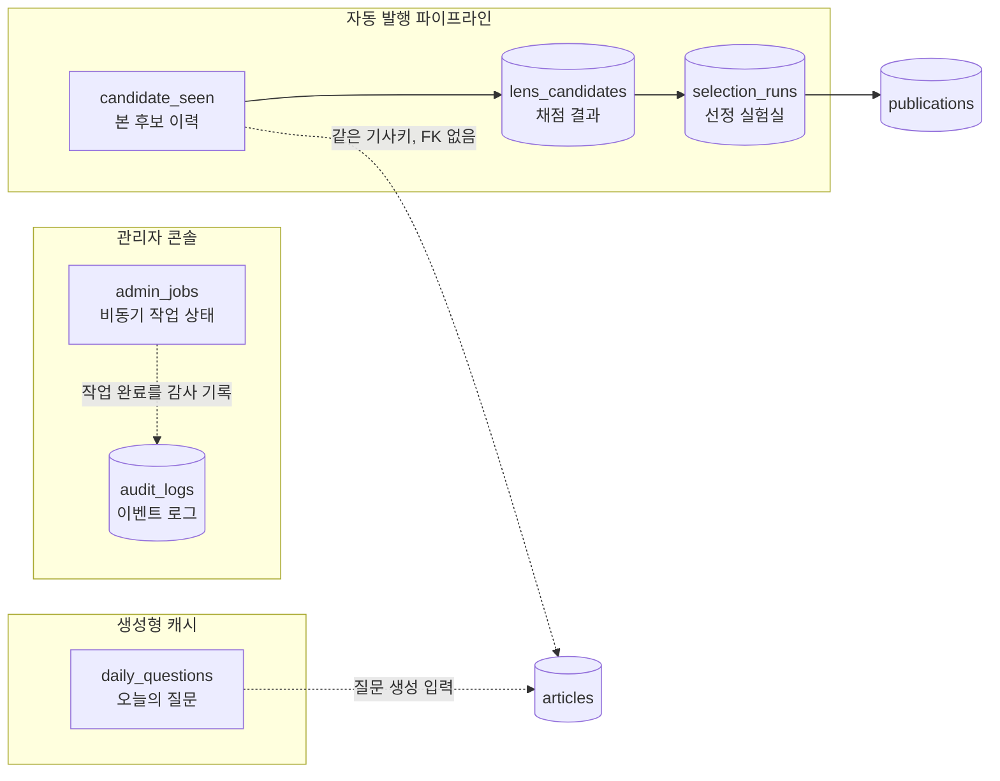
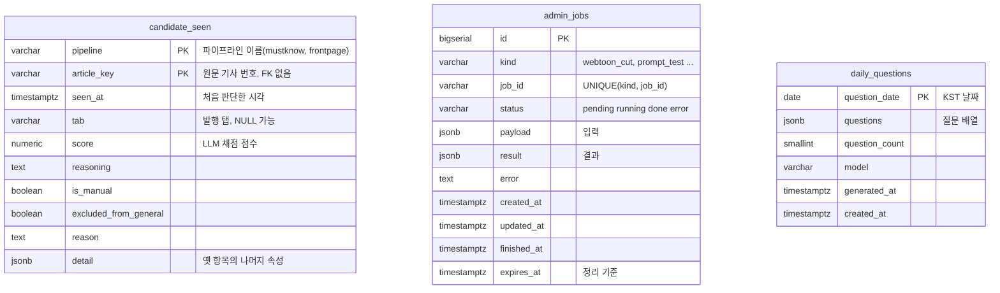

# 16. DynamoDB 잔여 데이터 이관 설계 (개념 → 논리 → 물리, 2026-10-09)

글·회원·퀴즈·구독자·기사·커뮤니티·감사로그는 v1.20~v1.35에서 Postgres로 옮겨졌다. 2026-10-09 점검(DynamoDB 최근 14일 쓰기 활동 + 호출 코드 추적)에서 **아직 DynamoDB에 쓰는 곳 5개**가 남았고, 모두 작은 보조 데이터다. 이 문서는 그 이관의 설계를 기존 관례(`lens_schema_2026-08-26.sql`, `13-physical-design.md`)에 맞춰 개념·논리·물리·확장성 순서로 정리한다. 실제 DDL은 `lens_schema_v1.36_2026-10-09.sql`, 실행·검증 기록은 `db-changelog/postgres/v1.36-ddb-잔여-이관.md`.

## 0. 이관 대상 판정

| DynamoDB | 쓰기 근거 | 판정 | 이유 |
|---|---|---|---|
| `mustknow-seen` (11,359) | ECS `mustknow_auto`, 하루 6회 | **이관** → `candidate_seen` | 중복 방지에 필수, 영구 누적 |
| `admin-config`의 `WEBTOONLAB`(757)·`PROMPTTEST`(8) | admin-api Lambda | **이관** → `admin_jobs` | 상태가 바뀌는 작업. 나머지 pk(`AUDIT` 675·`CONFIG`·`AUTH`)는 v1.27/28에서 옮겨진 잔재 |
| `personal`의 `__questions__` `DATE#`(89) | question Lambda(`/api/questions`) | **이관** → `daily_questions` | 홈이 매일 쓰는 생성 캐시. 나머지 sk(`READING`·`ARCHIVE`·`PROFILE`)는 v1.24에서 옮겨진 잔재, `ANSWER` 0건 |
| `articles`의 `news_briefing_latest` | briefing Lambda(하루 2회) | **이관하지 않음 — 기능 폐기** | 브리핑은 챗봇(ws·chatbot Lambda)용 컨텍스트인데 프론트가 챗봇을 호출하지 않는다(검색은 일반 검색으로 교체됨). 호출 14일 chatbot 11·ws 5건. 만들면 죽은 테이블이 된다 |
| `articles` 25,282건 | 쓰기는 위 브리핑 1건과 통합 테스트 잔재(`test_integ_*`) | 정본은 이미 Postgres `articles` | S3 내보내기 후 삭제 |
| `ws-connections` (0) | ws Lambda | 이관하지 않음 | TTL 24h 임시 데이터, 휴면 기능과 함께 폐기 |
| 나머지 8개(쓰기·읽기 0) | 없음 | 삭제 | 코드·IAM 참조 정리 후 |

## 1. 개념 설계 — 도메인과 엔터티

새로 생기는 개념은 셋뿐이고, 기존 12개 도메인(`00-map.mmd`)에는 "운영·자동화" 쪽에 붙는다.

- **candidate_seen** — "이 파이프라인이 이 기사를 이미 판단했다"는 사실. 채점 결과(`lens_candidates`)·선정 결과(`selection_*`)와 다른 점: 후보가 `articles`에 없을 수도 있고(원문 피드 단계), 발행되지 않은 기사도 포함한다. 그래서 기사 FK를 두지 않는다.
- **admin_jobs** — 관리자가 시작한 작업(웹툰 컷 생성, 프롬프트 테스트)의 진행 상태. `audit_logs`는 "있었던 일"의 추가 전용 기록이고 이쪽은 같은 행의 상태가 `pending → running → done|error`로 바뀌는 가변 레코드라 별개다.
- **daily_questions** — 그날의 질문 묶음. 첫 요청이 LLM으로 만들고 이후는 읽기만 하는 캐시(날짜가 자연키).

## 2. 논리 설계

정규화·키 판단:
- `candidate_seen`은 키가 복합(`pipeline`, `article_key`) — 같은 기사를 파이프라인마다 따로 본다. 점수·사유는 기사×파이프라인 종속이라 같은 행에 있어 3NF를 만족한다.
- `admin_jobs`는 대리키 `id`를 PK로, 클라이언트가 폴링에 쓰는 `(kind, job_id)`를 UNIQUE로 둔다. `payload`/`result`는 종류마다 모양이 달라 JSONB — 컬럼으로 풀면 새 종류마다 DDL이 필요해진다(DynamoDB의 "pk 네임스페이스 늘리기"가 하던 유연성을 같은 수준으로 유지하되 상태·시각은 정식 컬럼).
- `status`는 닫힌 집합이라 `CHECK`, `kind`는 열린 집합이라 앱 검증(선례: `selection_articles.verdict`).
- `daily_questions`는 날짜가 자연키라 대리키가 없다. 질문 개별 행으로 쪼개지 않는 이유: 항상 묶음으로 읽고 쓰며 개별 조회가 없다. 사용자 답변(`ANSWER#…`)은 DynamoDB에 0건이라 테이블을 만들지 않는다(확장 지점은 §4).

## 3. 물리 설계

| 테이블 | 접근 패턴 | 인덱스 | 권한 | 예상 규모 |
|---|---|---|---|---|
| candidate_seen | ① 후보 N건이 이미 있는지(배치 `article_key = ANY(...)`) ② 새 후보 upsert(`ON CONFLICT (pipeline, article_key) DO NOTHING`) | PK `(pipeline, article_key)`가 ①②를 처리, `(pipeline, seen_at DESC)`는 최근 이력·정리용 | SELECT·INSERT·UPDATE | 현재 11.4k, 하루 +수십~수백. 연 10만 미만 → 파티션 불필요 |
| admin_jobs | ① 생성 후 `(kind, job_id)`로 폴링 ② 부분 갱신(상태·결과) ③ 진행 중 작업 점검 ④ 만료 정리 | UNIQUE `(kind, job_id)`, 부분 인덱스 `(kind, created_at DESC) WHERE status IN ('pending','running')`, `(kind, created_at DESC)`, `(expires_at)` | SELECT·INSERT·UPDATE·DELETE + 시퀀스 | 수천 건 이하, 30일 후 정리 |
| daily_questions | ① 날짜 하나 조회 ② 없으면 생성해 upsert | PK `question_date` | SELECT·INSERT·UPDATE | 연 365행 |

- 호출은 전부 `lens-cms-api` 내부 라우트(`X-Internal-Token`)를 거친다(pipelines v1.32·admin `config_repo` 선례). 외부 호출자가 직접 DB에 붙지 않는다.
- 배치 조회로 바뀌는 점: 지금 `mustknow_auto`는 후보마다 `get_item`(실행당 100~300회)을 하는데, 이관 후 `exists` 한 번으로 줄인다.
- 정리: `admin_jobs`는 생성·조회 시 기회 삼아 `DELETE ... WHERE expires_at < now()`(작은 테이블이라 비용 무시). DynamoDB는 TTL이 꺼져 있어 쌓였던 것을 막는다.
- 타임존: 저장은 `timestamptz`, `daily_questions.question_date`만 KST 날짜(애플리케이션이 `Asia/Seoul`로 계산 — 범위 비교를 쓰는 다른 쿼리와 같은 원칙).

## 4. 확장성

- **다른 파이프라인**: `candidate_seen.pipeline`으로 mustknow 외 파이프라인(frontpage, 이후 신규)이 같은 테이블을 쓴다. 파이프라인별 보존 기간이 달라지면 `seen_at` 기준 정리 잡을 파이프라인 단위로 둔다.
- **규모 커질 때**: `candidate_seen`이 수백만 건이 되면 `seen_at` 월 범위 파티션으로 전환한다. PK에 파티션 키가 들어가야 하므로 그때는 `(pipeline, article_key, seen_at)`로 바꾸는 마이그레이션이 필요하다 — 지금은 키 조회가 핵심이라 단일 PK를 택했고, 전환 기준(1천만 건 또는 PK 인덱스가 메모리를 넘을 때)을 이 문서에 남긴다. `view_events`·`ai_usage_logs`의 pg_partman 운영(14-operations §2)을 재사용한다.
- **작업 종류 추가**: `admin_jobs.kind` 값만 늘린다. 결과가 커지면(이미지 바이너리 등) `result`에는 S3 URL만 저장하고 본문은 S3에 둔다. 진행률이 필요해지면 `progress SMALLINT` 컬럼을 추가한다(DDL 한 줄).
- **질문 답변 기능**이 생기면 `daily_question_answers(question_date, question_id, user_id, answer, answered_at)`를 `users` FK로 추가한다(지금은 데이터가 없어 만들지 않는다).
- **모델 변경 추적**: 생성형 캐시는 `model`을 남겨 모델·프롬프트 교체 시 재생성 대상을 식별한다(`article_embeddings.model_id`와 같은 원칙).
- **다음 서버 이전**(서버리스 정리): 위 접근이 전부 내부 HTTP 라우트라서 호출자가 Lambda에서 상시 서버로 옮겨 가도 DB 스키마는 영향받지 않는다.

## 5. 운영 결정

| 결정 | 내용 |
|---|---|
| DDL 실행 | 마스터 계정(`lens_admin`)을 사용자가 직접 실행. SQL은 멱등(`IF NOT EXISTS`), 롤백 SQL은 파일 하단 주석 |
| 전환 방식 | 호출자마다 환경변수 스위치(`*_BACKEND=pg|ddb`, 기본 ddb) → 검증 후 pg. DynamoDB 테이블은 쓰기 0 확인 + 온디맨드 백업 전까지 삭제하지 않는다 |
| 데이터 이관 | `--apply` 없으면 드라이런, 백업 JSON, `ON CONFLICT DO NOTHING`(재실행 안전), 건수·샘플 대조 |
| 이관 범위 | `candidate_seen` 전량(중복 방지에 필수), `daily_questions` 89건 전량, `admin_jobs`는 최근 30일분(이전 완료 작업은 의미 없는 로그라 JSON 보관만) |
| 폐기 | 브리핑(`news_briefing_latest`)·챗봇·웹소켓은 이관하지 않고 기능과 함께 정리(별도 확인) |

← [lens-erd-src README](README.md)
