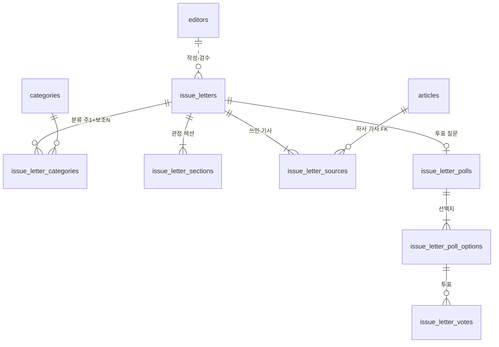

# 17. 이슈 레터(모아쓰기 레터) 설계 (개념 → 논리 → 물리 → API, 2026-10-09)

기획·결정: `docs/product/모아쓰기레터/README.md`(Q1~Q8 결정 기록). 화면: 목업 `service/frontend/src/features/letter/`(확정 전 검수 완료). DDL: `lens_schema_v1.37_2026-10-09.sql`(초안, 로컬 Postgres 16에서 적용·재적용·제약 동작 검증). 내부 이름은 옛 "레터"와 구분하려고 `issue_letter`로 쓴다.

## 1. 개념 설계

하나의 이슈를 소식·실체·다른 시각 세 관점으로 읽는 글 한 편이 "이슈 레터"다. 기사(articles)를 근거로 쓰이고, 독자가 투표로 반응한다.

## 2. 논리 설계 — 결정과 이유

| 결정 | 이유 |
|---|---|
| 본문은 섹션 테이블 + 문단 JSONB(`paragraphs`) | 문단 단위로 따로 조회·집계할 일이 없고, 인라인 링크 조각이 문단 안에서 순서대로 섞이는 구조라 정규화하면 조각 테이블이 하나 더 생겨 과하다. 대신 API 검증기가 형식을 강제 |
| 출처는 `article_no` FK 또는 외부(제목·매체·URL) 중 하나만(CHECK) | 자사 기사는 제목·링크를 DB에서 읽어 항상 실제와 일치(지어내기 방지). 외부는 편집장 승인(`approved_by`) 없으면 입력 불가(Q4) |
| `article_no` FK는 `ON DELETE RESTRICT` | 레터가 근거로 쓴 기사가 사라지면 근거가 사라진다. 기사 삭제 전에 레터를 먼저 정리하게 한다 |
| 분류는 별도 테이블(주 1 + 보조 N, 부분 UNIQUE)이고 **사이트 분류 slug 문자열**로 저장(v1.38) | Q3. DB `categories`는 옛 7분류라 사이트 9분류(시그널·사회 등)를 담지 못한다(v1.37 초안의 FK 설계 오류를 v1.38에서 교체). 분류의 정본은 사이트 코드(`econCategories.ts`)이고 앱(`SITE_CATEGORIES`)이 검증 |
| 상태 `draft → in_review → published → archived` + 발행 CHECK | 발행본은 호수·발행 시각·검수자 필수(Q7). 검수자가 `role=admin`인지는 앱이 확인(DB는 "검수자 있음"까지만) |
| 소프트 삭제(`deleted_at`) | publications와 같은 규칙. 앱 역할에 DELETE 권한을 주지 않는다 |
| 투표: PK `(letter_id, voter_hash)` | 한 사람 한 표를 DB가 보장. 해시는 서버 비밀 솔트 + (로그인 사용자 id 또는 익명 쿠키 id)의 SHA-256, 원문은 저장하지 않는다(Q6). 투표 변경·삭제는 허용하지 않아 권한도 SELECT/INSERT만 |
| 투표 선택지 FK `(letter_id, option_key)` | 존재하지 않는 선택지에 투표할 수 없다 |
| 호수 `issue_no` UNIQUE, 발행 시 부여 | 초안은 NULL. 번호 채번은 발행 트랜잭션에서 `max+1`(동시 발행이 드물어 시퀀스 대신 UNIQUE로 충돌 방지) |
| 조회수·구독 등은 이번 범위 밖 | 계측은 GA4 이벤트(`letter_source_click` 등), 구독은 Phase 3에서 기존 `newsletter_subscribers` 재사용 검토 |

## 3. 물리 설계

| 인덱스 | 용도 |
|---|---|
| `issue_letters_published_idx` (부분: 발행·미삭제, `published_at DESC`) | 목록·피처드(최신 1편) |
| `issue_letters_search_idx` GIN(`search_vector`) | 검색(제목 A·deck B·에디터 한마디 C) |
| `issue_letter_categories_cat_idx` | 분류 필터 |
| `issue_letter_categories_primary_uq` (부분 UNIQUE) | 주 분류 1개 보장 |
| `issue_letter_sources_article_idx` (부분) | "이 기사를 쓴 레터" 역조회(기사 페이지 연결에 대비) |
| `issue_letter_votes_agg_idx` | 결과 집계 |

용량: 하루 1~수 편, 레터당 섹션 3~4·출처 3~5·투표는 수백~수만 행. 파티셔닝 불필요. 투표가 수백만 행을 넘기면 레터별 집계 캐시 테이블을 추가한다(이번 범위 밖).

## 4. API 스펙 (lens-cms-api, 모듈형 모놀리스 `content`/`editorial` 도메인)

옛 `/admin/letters*`(폐기 후보, 빈 테이블)와 충돌하지 않도록 경로는 `issue-letters`를 쓴다.

### 공개 (인증 없음, 캐시 가능)
| 메서드·경로 | 설명 |
|---|---|
| `GET /api/v2/issue-letters?category=&limit=&cursor=` | 발행본 목록(최신순). 카드용 필드(제목·deck·분류·호수·기사 N건·키워드 태그) |
| `GET /api/v2/issue-letters/{slug}` | 상세. 섹션·문단·출처(자사는 articles에서 제목·URL 조인)·투표 질문·1분 요약 |
| `POST /api/v2/issue-letters/{slug}/vote` | 본문 `{option_key}`. 식별자는 로그인이면 사용자 id, 아니면 익명 쿠키 id를 서버가 해시. 응답 = 선택지별 집계(투표한 사람에게만 결과 공개). 이미 투표했으면 409와 기존 선택·집계 |
| `GET /api/v2/issue-letters/{slug}/vote` | 내 투표 여부와(했다면) 집계 |

### 관리 (관리자 토큰, 감사로그 기록)
| 메서드·경로 | 설명 |
|---|---|
| `GET /admin/issue-letters?status=` | 목록 |
| `POST /admin/issue-letters` / `PUT /admin/issue-letters/{id}` | 초안 생성·저장(섹션·출처·투표를 한 번에 교체 저장) |
| `POST /admin/issue-letters/{id}/submit` | draft → in_review |
| `POST /admin/issue-letters/{id}/publish` | in_review → published. 편집장(role=admin)만, 작성자 본인 승인 불가. 호수 부여·발행 시각 기록 |
| `POST /admin/issue-letters/{id}/archive` | published → archived |
| `GET /admin/issue-letters/candidates?q=` | 출처 후보 기사 검색(articles 전문검색). 레터 작성 때 자사 기사를 고르는 용도 |

### 발행 전 검증(서버가 강제, 실패하면 publish 거부)
1. 섹션 3개 이상, 각 섹션에 `key_line`
2. 서로 다른 자사 기사 URL을 본문 인라인 링크로 3개 이상
3. 본문 인라인 링크는 전부 `issue_letter_sources`에 있는 기사여야 함(출처에 없는 링크 금지), 출처 패널의 자사 기사는 articles에 실제 존재
4. 외부 기사 출처는 `approved_by` 필수(DB도 강제)
5. 자리표시("(예시)") 출처 없음
6. 금융(`finance`) 분류는 투표 kind=`emotion`만
7. 에디터 한마디·1분 요약 존재

### 계측(프론트, GA4)
`letter_source_click`, `letter_vote`, `letter_summary_toggle`, `letter_next_cta_click`(목업에 구현됨). 서버 지표는 투표 집계만.

## 5. 마이그레이션·전환 순서

1. DDL v1.37 사용자 검토 → 마스터 계정으로 실행(사용자). 검증 쿼리·권한 확인
2. lens-cms-api: `issue_letters_repo.py`(저장소) + 라우트 + nginx location(`/api/v2/issue-letters`, `/admin/issue-letters`) + 단위 테스트(가짜 커서, v1.36 방식)
3. 프론트: mock → API 교체(`features/letter/data` 소비 지점만), `noindex` 유지
4. 관리자 화면: 작성 폼·검수·발행 체크리스트(가장 큼, 별도 단계)
5. 정식 오픈: `noindex` 해제, 푸터·전체 메뉴·사이트맵·`llms.txt`·JSON-LD(NewsArticle, `isBasedOn`)
6. 샘플 3편(라네즈·종로3가·부캉이) 입력·검수. 삼성 107조는 원본 수령 후(Q8)
7. 구독(Phase 3)은 별도 설계

## 6. 위험·열린 점

| 항목 | 내용 |
|---|---|
| 원본 샘플 본문의 숫자 | 부캉이 샘플 숫자가 연결된 기사 숫자와 다름(워크로그 참조). 입력 전 작성자 확인 필요 |
| 익명 투표 어뷰징 | 쿠키 삭제로 중복 가능. 투표수가 의미를 가질 만큼 늘면 IP·속도 제한 추가(Q6 재검토 조건) |
| 작성 부담 | 관리자 폼이 일정의 가장 큰 변수(기획서 원안과 동일). 1차는 JSON 입력 폼 + 미리보기로 시작하는 선택지 있음 |
| 기사 삭제 | RESTRICT라 레터가 쓴 기사는 삭제 불가. 기사 삭제 정책이 있으면 소프트 삭제로 맞출 것 |
