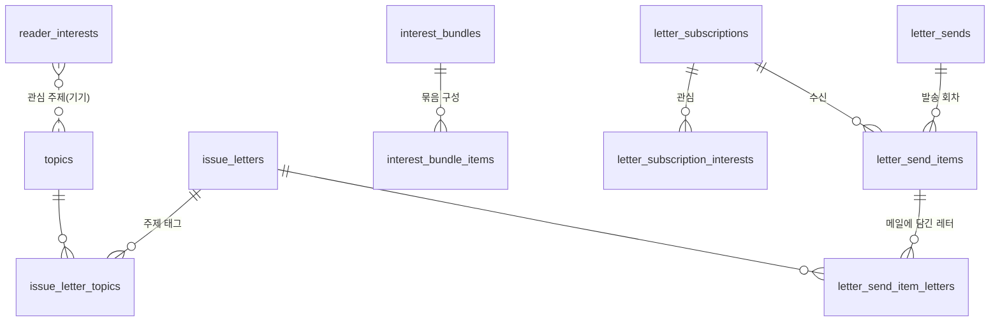

# 19. 독자 관심·이메일 구독 설계 (2026-10-09, 설계·DB 초안, 미구현)

레터가 수백 편 쌓이고 독자가 늘어난 상태를 기준으로 구조를 잡고, 한 번에 만들지 않고 단계로 나눈다. DDL 초안은 `lens_schema_v1.42_2026-10-09.sql`(로컬 Postgres 16에서 적용·재적용·제약 동작·추천 점수 쿼리 검증).

## 1. 문제와 방향

| | 내용 |
|---|---|
| 문제 | 레터가 쌓일수록 독자는 "내게 맞는 레터"를 찾기 어렵고, 다시 오게 할 장치(구독)가 없다. 페르소나 기획서(2026-10-08)는 이 문제를 짚었지만 ① "왜 이 기사가?" 문구가 해석·권유("배당 유지·증가 논거가 돼요", "취업 준비라면 필독")여서 중립 원칙과 충돌하고 ② 가상 인물 8개에 기대며 ③ 레터가 적을 때는 효과가 없다는 한계가 있었다 |
| 기존 | 레터 목록은 최신순과 분류 필터뿐. 이메일 기반 시설(SES 도메인, 구독자 테이블, 발송 코드)은 있으나 "지면 1면 뉴스레터"용이고 구독자 5명 |
| 방향 | ① 레터에 **주제 태그**를 붙이는 체계를 먼저 만든다(나중에 고치기 가장 비싼 메타데이터) ② 독자는 **관심 분야·주제**를 고른다(가상 인물이 아니라 "관심 묶음 프리셋") ③ 추천·구독은 **겹침 점수**로 계산하고 이유는 **겹친 주제 이름만** 말한다 ④ 이메일은 **다이제스트**(일간·주간)가 기본 |

## 2. 원칙
- **중립**: 이유 문구는 "관심 주제 '금리'·'삼성전자'를 다뤘어요"처럼 레터에 실제 있는 사실만. 독자 삶에 대한 해석·권유 금지. 메일 본문도 제목·한 줄 요약·링크만
- **개인정보 최소**: 계정 없이 시작(기기 식별자). 이메일과 관심 설정은 따로 보관하고, 관심용 식별자는 투표 식별자와 다른 네임스페이스로 해시해 서로 잇지 않는다
- **통제 어휘**: 태그는 자유 입력이 아니라 편집팀이 관리하는 주제 사전 + 별칭. 자유 태그는 "금리/기준금리/금리인상"으로 갈라져 추천이 망가진다
- **설명 가능**: 점수 공식은 단순 합산이라 왜 이 순서인지 말할 수 있어야 한다. LLM이 독자별 문구를 만들지 않는다

## 3. 개념·논리 설계

| 테이블 | 역할 | 핵심 제약 |
|---|---|---|
| `topics` | 주제 사전(topic·company·person·place) + 별칭 | slug 형식 CHECK, name·slug 유일, 별칭 GIN 인덱스 |
| `issue_letter_topics` | 레터의 주제 태그(주 주제 + 보조) | PK (letter, topic), 주제 삭제 RESTRICT |
| `interest_bundles`·`interest_bundle_items` | 관심 묶음 프리셋(분류·주제의 묶음) | 묶음 삭제 시 항목 CASCADE |
| `reader_interests` | 익명 기기의 관심(분류·주제) | PK (reader, type, key) |
| `letter_subscriptions` | 이메일 구독. pending → active 이중 확인, 동의 시각·약관 버전 | 이메일(소문자·공백 정규화) 활성·대기 중 유일, **발송 시각 8~20시 CHECK(야간 제한)** |
| `letter_subscription_interests` | 구독의 관심 | PK (subscription, type, key) |
| `letter_sends`·`letter_send_items`·`letter_send_item_letters` | 발송 회차, 수신자별 결과, 한 통에 담긴 레터 | (종류, 날짜, 시각) 유일 + (회차, 구독) 유일 → **같은 메일 두 번 방지** |
| `email_suppressions` | 반송·수신거부 신고 주소(구독이 지워져도 남음) | 이메일 PK |

기존 `subscriptions`는 지면(section) 1면 뉴스레터에 묶여(`newsletter_id NOT NULL`) 섞지 않는다. 기존 구독자는 동의 범위가 달라 새로 동의를 받아 옮긴다.

## 4. 추천 방식
점수 = (주제 겹침 3점, 레터의 주 주제면 +1) + (분류 겹침: 레터 주 분류 2점, 보조 1점), 여기에 **최신성 감쇠** `0.5^(경과일/30)`를 곱한다. 이유 = 겹친 주제 이름(최대 3개). 검증 결과(독자 관심: 금리·삼성전자·부동산 분류): 삼성 실적 레터 6.84 > 금리·환율 레터 3.17 > 임대료 레터 0.79, 이유는 `{금리, 삼성전자}` 등.
- 레터가 수천 편이어도 후보를 최근 N개로 제한하면 요청 시점 SQL로 충분하다. 느려지면 레터 발행 때 점수 재료를 미리 계산한다(캐시)
- 관심 설정이 없는 독자는 지금과 같은 최신순
- 개인화 정렬은 목록의 한 구역("내 관심사")으로 얹고, 기본 최신순 목록은 유지 → 편향 논란 방지

## 5. 관심 묶음 (페르소나 기획서의 8개를 중립적으로 옮긴 예)
| 기획서 페르소나 | 관심 묶음 이름(예) | 구성(예, 사전 확정 후 조정) |
|---|---|---|
| 직장인 투자자 | 주식·ETF·금리·환율 | 분류 시그널·금융, 주제 금리·환율·ETF·삼성전자 |
| 취준생 | 취업·경제 입문 | 분류 경제·사회, 주제 채용·경제 용어 |
| 자영업자 | 소비·임대·금리 | 분류 경제, 주제 임대료·최저임금·소비 |
| 워킹맘 | 부동산·교육비 | 분류 부동산·사회, 주제 청약·교육비 |
| 창업자 | 스타트업·투자 | 분류 산업, 주제 스타트업·벤처투자 |
| 부동산 관심자 | 부동산·규제 | 분류 부동산, 주제 금리·대출 규제 |
| 은퇴 준비자 | 연금·배당 | 분류 금융, 주제 연금·배당 |
| 연구자 | 국제·정책 | 분류 국제·정치, 주제 통상·정책 |

독자 화면에는 사람이 아니라 묶음 이름만 나간다. 선택하면 분류·주제가 채워지고 이후 개별 조정한다.

## 6. API 스케치 (lens-cms-api)
| 구분 | 경로 | 내용 |
|---|---|---|
| 공개 | `GET /api/v2/issue-letters?interest=me` | 독자 관심이 있으면 점수순 구역 + 이유 반환 |
| 공개 | `PUT /api/v2/readers/me/interests` | 이 기기의 관심 교체 저장(기기 식별자 헤더) |
| 공개 | `GET /api/v2/interest-bundles`, `GET /api/v2/topics` | 묶음·사전 |
| 공개 | `POST /api/v2/letter-subscriptions` → `GET …/confirm?token=` / `…/unsubscribe?token=` | 가입(pending) → 확인 메일 → 활성, 수신거부 |
| 관리 | `/admin/topics`, `/admin/interest-bundles`, `/admin/letter-sends` | 사전·묶음 편집, 발송 미리보기·수동 발송 |

## 7. 발송 설계 (레터가 많아도 스팸이 되지 않게)
- 레터마다 즉시 메일이 아니라 **다이제스트**: 일간(지정 시각 8~20시)·주간. 독자가 빈도를 고른다. 즉시 발송은 선택 사항
- 구독자별로 최근 N일의 발행 레터 중 관심과 겹치는 상위 M개(기본 3)를 담는다. 겹치는 레터가 없으면 보내지 않는다
- 배치: 시각마다 `letter_sends`를 만들고 구독자 단위로 `letter_send_items`를 만들어 SES로 보낸다. (회차, 구독) 유일 제약으로 재실행해도 중복 발송이 없다. 반송·신고는 `email_suppressions`에 넣어 이후 제외
- 법·운영: 광고성 정보 전송 동의 기록, 모든 메일에 수신거부 링크, 발신자 표기, 21시~8시 발송 금지(CHECK로 강제)

## 8. 단계 (되돌릴 일 없게 앞에서부터)
| 단계 | 내용 | 지금 하는 이유 |
|---|---|---|
| **Phase 0** | 주제 사전(`topics`) + 레터 태그. 템플릿 v2 JSON에 `topics` 추가, 서버가 사전·별칭으로 검증·정규화, 기존 3편에 태그 부여 | 레터가 쌓이기 전에 해야 소급 비용이 없다. 이후 모든 기능의 전제 |
| Phase 1 | 관심 묶음·독자 관심 설정, 목록의 "내 관심사" 구역과 사실형 이유, 이메일 가입 폼(pending→확인) | 구독자 수집을 시작하고 개인화 효과 측정 |
| Phase 2 | 다이제스트 수동 발송 → 자동 발송, 발송·오픈 지표 | 재방문 장치 |
| Phase 3 | 계정 연동, 행동(클릭) 기반 관심 보정, 대시보드, 레터 아카이브 검색·주제 페이지 | 규모가 커진 뒤 |

## 9. 위험·결정 필요
| 항목 | 내용 |
|---|---|
| 주제 사전 운영 | 사전이 커지면 관리 부담. 초기 50~100개로 시작하고 AI가 제안한 신규 태그는 사람이 승인 |
| 중립 | 개인화 정렬이 편향으로 보일 수 있어 기본 최신순을 유지하고 구역으로 분리 |
| 이메일 | 구독자 5명 수준에서 시작. 도메인 평판 관리(반송률·신고율)와 법 준수가 핵심 |
| 결정 | (1) 주제 사전의 초기 범위와 분류 체계 (2) 관심 묶음 이름·구성 확정 (3) 다이제스트 기본 빈도·시각 (4) 기존 구독자 5명 재동의 방식 |
