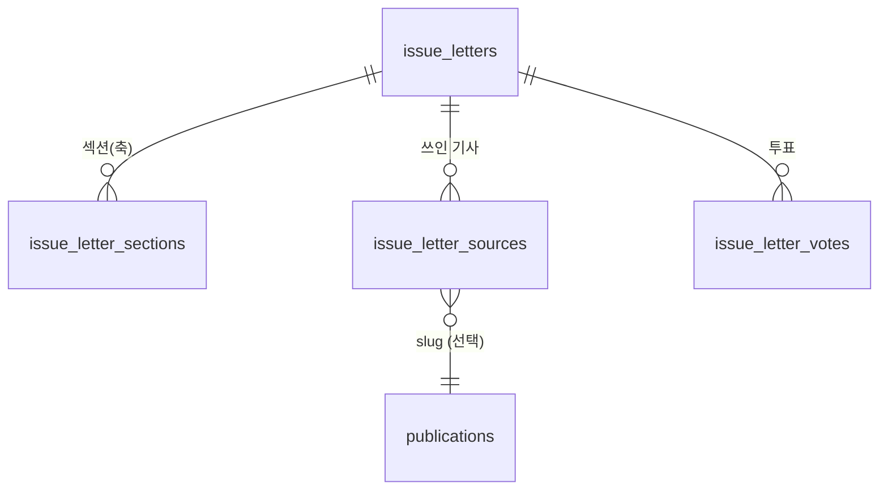

# 모아쓰기 레터 — 개발 기획서 (v0.1, 2026-10-09)

상태: **기획 단계 — 개발 착수 전.** 기획 원본(홍예린, 2026-10-08)을 개발 관점으로 검토하고, 이 시스템에 어떻게 얹을지와 결정이 필요한 항목을 정리한다.
원본 위치: `product/2_ai_lens/마스터DB/06_콘텐츠/레터/` (HTML 7종 — 아래 §1)

## 1. 원본 문서 7종 요약

| 문서 | 내용 | 개발에 쓰는 부분 |
|---|---|---|
| 기획서_모아쓰기레터 | 문제(1기사형은 맥락 없음), 제안(3~5개 기사를 소식→실체→다른 시각 3축으로 엮기), 독자 3유형, 지표, 로드맵 | 목표·지표·Phase |
| 레터탭_기획서_v3 | 기존 탭 vs 제안 비교, `/letter` 목록·상세 목업, **데이터 모델(신규 필드)**, URL, Phase 1~3 | 데이터 모델·URL·화면 |
| 레터생성_프롬프트템플릿_v1 | 시드 URL → 추가 기사 3건↑ 조사 → 3축 구조 → 자가 점검. 규칙(짧은 문장, 반말체, 지어내기 금지, 인라인 링크, 2,500~3,500자, 에디터 한마디, 투표) | Phase 2 AI 초안, 발행 전 체크리스트 |
| 페르소나 설정 | 독자 8유형별 기사 추천 예시(관심 키워드·읽지 않을 기사·관련도) | 별도 기획(개인화 추천, 레터 탭과 분리) |
| letter 부캉이 / 아모레퍼시픽 / 종로3가 | 실제 작성된 샘플 3편(3축 구조 검증) | 본문 구조 샘플·화면 기준 |

## 2. 점검 결과 (원본의 빈틈·충돌)

| # | 점검 사항 | 근거 | 제안 |
|---|---|---|---|
| 1 | **용어 충돌**: 사이트에는 이미 기사 한 건을 4형식으로 보여주는 "레터"(첫 탭)가 있다. 새 "모아쓰기 레터"는 다른 상품이다 | 기사 페이지 탭 레터·웹툰·팟캐스트·영상 / 기획서 "기존 탭 vs 제안" | 사용자 노출 이름은 "레터" 유지 여부를 결정(§9 Q1). 내부 코드명은 `issue_letter`로 분리 |
| 2 | **URL 충돌 소지**: 기획은 `/letter`(단수). 이미 `/letters`(복수)와 `/letters/{id}`가 308 이동으로 남아 있다 | `next.config.ts`(/letters → /lens), `letters/[id]`→기사 308 | `/letter`는 신규 경로라 동작상 충돌 없음. 다만 혼동되므로 `/issue` 같은 대안도 비교(§9 Q2) |
| 3 | **분류 체계가 옛 것**: 목업 내비가 증시·시그널·부동산·산업·금융·정책·국제(옛 6개). 사이트는 9개로 개편됨 | 기획서 목업 vs `econCategories.ts`(시그널·부동산·경제·금융·산업·정치·사회·국제·문화) | 레터 카테고리를 9개 분류와 일치. 한 레터가 두 분류에 걸치면(`증시·국제`) 주 분류 1 + 보조 분류 N |
| 4 | **GA4 이벤트명이 부정확**: `page_engagement`, `outbound_click`, `returning_user`는 표준 이벤트가 아님 | 기획서 §6 | 표준(`user_engagement`, 향상된 측정의 outbound `click`, 신규/재방문 사용자 차원)이나 커스텀 이벤트로 명시하고 기준값(baseline)부터 측정(현재 "미측정") |
| 5 | **조사 방식이 웹 검색 전제**: 프롬프트는 Claude/GPT에 붙여넣어 외부 기사까지 검색. 자동화(Phase 2) 서버에는 웹 검색이 없다 | 템플릿 1단계 | 1차는 자사 기사 DB(`articles`·관련 뉴스)에서 후보 선정. 외부 매체 인용은 편집 정책 결정 필요(§9 Q4) |
| 6 | **샘플 편차**: 3편의 섹션 이름·개수가 다르다(부캉이=타임라인·경제학·팩트체크·논쟁, 종로3가=선정 소식·순위의 실체·다른 시각, 아모레=같은 달 다른 선택·숫자·더 큰 그림). "핵심:" 라벨, 1분 요약, 투표 형식도 조금씩 다름 | 샘플 3편 | 데이터 모델은 "축(axis) + 섹션 N개" 유연 구조로. 필수 최소 규칙만 강제(§4) |
| 7 | **삼성전자 107조 레터 원본이 폴더에 없음**: v3 기획서의 핵심 예시인데 파일이 없다 | 폴더 목록 | 원본 파일 확보(검증 샘플은 3편이 아니라 4편이 되어야 함) |
| 8 | **발행 편수 불일치**: "매일 1편"인데 목록 목업에는 10/08에 2편 | 기획서 §5 vs v3 목업 | 편수는 운영 규칙(§9 Q5). 모델은 일 N편 허용 |
| 9 | **금융 소재 투자 판단형 투표 금지** 규칙이 있는데 데이터 모델 `vote_type`은 binary/multi뿐 | 템플릿 2단계 vs v3 기술 명세 | `vote_kind`: `emotion`(감정반응형)·`binary`·`multi`와 "투자 판단 문구 금지"를 편집 체크리스트로 |
| 10 | **성공 지표의 현재값 가정**: 체류 ~3분 등은 측정값이 아님 | 기획서 §6 | 측정 후 목표 재설정(Phase 1 종료 시 비교) |
| 11 | **표시 문구**: 샘플은 "본 레터는 서울경제신문 AI LENS 기사를 바탕으로 작성"인데 종로3가는 외부 매체 기사 기반 | 샘플 푸터 | 출처 표기 규칙 통일(§9 Q4) |
| 12 | **페르소나 추천은 별건**: 개인화는 로그인·읽은 기록·개인정보 처리가 얽혀 레터 MVP와 일정이 다르다 | 페르소나 설정 | 이번 기획에서 제외, 별도 기획(Phase 3 이후) |

## 3. 범위와 단계

| 단계 | 내용 | 완료 기준 |
|---|---|---|
| Phase 1 (MVP, 원본 2~3주 → 아래 §8 재산정) | 편집자 수동 발행. 목록·상세·"쓰인 기사 패널"·3축 배지·1분 요약 접기·카테고리 필터·투표(감정반응형)·SEO | 편집자가 레터를 발행 → 목록 카드에 3축 배지·기사 N건 표시, 상세에 패널·인라인 링크 동작, 투표 집계 노출 |
| Phase 2 | URL 입력 → AI 초안, 3축 자동 제안, 기사↔레터 역연결(기사 페이지에 "이 이슈를 다룬 레터") | 편집 10분 목표 |
| Phase 3 | 구독(이메일·알림), 아카이브 검색, 공유 | 구독 루프 지표 |
| 제외 | 페르소나 맞춤 추천 | 별도 기획 |

## 4. 데이터 모델 (개념 → 논리 → 물리)

**개념**: 레터 한 편 = 하나의 이슈 + 여러 기사(소스) + 여러 축(섹션) + 에디터 한마디 + 투표. 기존 `publications`(기사 1건·4렌디션)와는 별개 엔터티이고, 소스 기사로 `publications`(slug)를 참조한다.

| 테이블 | 핵심 컬럼 | 비고 |
|---|---|---|
| `issue_letters` | `id`, `slug`(UNIQUE), `issue_number`(호), `title`(레터 전용 제목), `summary`(1분 요약), `editor_note`, `category`(주 분류, 9개 중 하나), `sub_categories`(TEXT[]), `status`(draft/published/archived), `is_featured`, `vote_kind`(emotion/binary/multi), `vote_question`, `reading_minutes`, `cover_image_url`, `published_at`, `created_at`, `updated_at`, `deleted_at`, `created_by` | 기존 `publications` 관례(soft delete·`updated_at`) 그대로 |
| `issue_letter_sections` | `letter_id`, `position`, `axis`(`news`/`substance`/`other_view`), `heading`, `key_line`("핵심:" 한 줄), `body_html`(인라인 링크 포함, 서버에서 sanitize) | 축은 필수 3종 각각 ≥1, 같은 축 여러 개 허용(부캉이 샘플) |
| `issue_letter_sources` | `letter_id`, `position`, `article_slug`(FK 선택), `url`, `title`, `outlet`, `axis`, `is_internal` | 서울경제/AI LENS 기사는 `article_slug`로 연결(역연결에 사용), 외부 기사는 `url`만 |
| `issue_letter_votes` | `letter_id`, `option_key`, `voter_key`(로그인 사용자 id 또는 익명 쿠키 해시), `created_at`, UNIQUE(`letter_id`,`voter_key`) | 1인 1표, 집계는 읽을 때 count 또는 `issue_letter_vote_counts` 캐시 |

규칙(DB 또는 서버 검증): 발행 시 서로 다른 소스 기사 ≥3 · 3축 모두 존재 · "다른 시각" ≥1 · `key_line` 필수 · 금융 분류에서 `vote_kind`는 `emotion`만(초안 문구 점검은 편집 체크리스트).
인덱스: `issue_letters (status, published_at DESC) WHERE deleted_at IS NULL`, `(category, published_at DESC)`, `issue_letter_sources (article_slug)`(기사→레터 역연결), `issue_letter_votes (letter_id)`.
확장성: 소스·섹션 모두 별도 테이블이라 축이나 소스 수가 늘어도 컬럼 변경이 없다. 투표는 `option_key` 방식이라 선택지 수가 가변. Phase 2의 AI 초안은 `issue_letters.status='draft'` + `generation_meta JSONB`(모델·프롬프트 버전)로 같은 테이블에 담는다.
DDL은 이 문서가 아니라 `v1.37` 변경 이력으로 별도 작성하고 마스터 계정으로 적용(현 절차).

## 5. API (도메인 모듈 기준 — [라우트-도메인-맵](../../architecture/라우트-도메인-맵.md))

| 도메인 | 라우트(제안) | 설명 |
|---|---|---|
| content | `GET /api/v2/letters`(목록·`cat`·`featured`·페이지), `GET /api/v2/letters/{slug}`(상세: 섹션·소스·집계) | 공개, 5분 ISR 캐시와 같은 방식 |
| editorial | `POST/GET/PUT/DELETE /admin/letters`(이름 충돌 주의: 기존 `/admin/letters`는 폐기 후보 DynamoDB 화면), `POST /admin/letters/{id}/publish` | 관리자 발행 패널. 기존 `/admin/letters`는 먼저 제거하고 `/admin/issue-letters`로 쓰는 편이 안전 |
| members | `POST /api/v2/letters/{slug}/vote` | 1인 1표, 익명은 쿠키 해시 |
| automation(Phase 2) | `POST /internal/issue-letters/draft`(URL→초안) | Bedrock inference profile ARN 경유(비용 태그 규칙) |

## 6. 화면·URL

| 경로 | 내용 |
|---|---|
| `/letter` | 오늘의 레터(피처드) + 지난 레터 그리드 + 카테고리 필터. 카드: 주/보조 분류, 제목, 한 줄 요약, 3축 배지, "기사 N건", 날짜·읽는 시간 |
| `/letter/{slug}` | 헤더(분류·호수·제목·축 배지) → **이 레터에 쓰인 기사 패널**(본문 위) → 1분 요약(접기) → 섹션들 → 에디터 한마디 → 투표 → 원문 기사 링크 |
| `/admin/letter/new` | 편집 폼(기획서 경로명. 관리자 앱 기존 규칙에 맞춰 최종 경로 결정) |
| 기사 상세(역연결, Phase 2) | "이 이슈를 다룬 레터" 카드 — `issue_letter_sources.article_slug`로 조회 |

디자인은 기존 사이트 톤(손글씨 폰트 금지, 서울경제 파란 강조색 `#5b8def`)과 모바일 우선(max-width 640px 본문)을 따른다. 상세 HTML 본문은 기획서의 위젯 HTML을 그대로 쓰지 않고 구조화 필드(섹션·배지)로 렌더(인라인 스타일 의존 제거).

## 7. SEO·GEO

| 항목 | 설계 |
|---|---|
| 구조화 데이터 | `NewsArticle`(또는 `Article`) + `isBasedOn`(소스 기사 목록) + `citation` + `BreadcrumbList`, `ItemList`(쓰인 기사 N건). 투표/에디터 한마디는 `FAQPage`가 아니므로 제외 |
| canonical | `/letter/{slug}` 자기 자신. 소스가 AI LENS 기사면 `isBasedOn`으로만 연결(기사 canonical은 그대로) |
| 사이트맵 | `/sitemap/letters.xml` 추가(색인 `sitemapIds()`에 항목). `llms.txt`에 "이슈 레터" 설명 한 줄 |
| 중복 방지 | 소스 기사와 본문 문장이 겹치지 않도록 서술형 재구성(요약+맥락). 레터 본문은 인라인 링크 포함 — AI·검색엔진이 연결을 읽기 좋음 |
| 숨은 질문 | 섹션마다 "핵심:" 한 줄을 `speakable` 후보로 사용 |

## 8. 일정·공수 재산정 (추정, 확정 아님)

| 작업 | 내용 | 추정 |
|---|---|---|
| DB·API | 테이블 4개 DDL, 저장소·라우트, 검증 규칙, 단위 테스트 | 3~4일 |
| 관리자 폼 | 섹션·소스 편집, 인라인 링크 삽입, 발행 전 체크리스트 | 4~5일 |
| 공개 화면 | 목록·상세·패널·투표·모바일 | 4~5일 |
| SEO·계측 | JSON-LD, 사이트맵, GA4 이벤트, 문서 | 2일 |
| 콘텐츠 이관 | 샘플 4편(삼성전자 포함) 입력, 검수 | 1~2일 |
| 합계 | 원본 "2~3주" 범위 내 가능하나 관리자 폼이 가장 큰 변수 | 약 2.5~3주 |

## 9. 결정이 필요한 질문

| # | 질문 | 영향 |
|---|---|---|
| Q1 | 사용자 노출 이름: 기존 "레터"(4형식 첫 탭)와 새 "레터" 탭을 어떻게 구분할까 (예: 새 이름 "이슈 레터"/"모아쓰기") | 내비·문구·SEO 제목 |
| Q2 | 경로: `/letter`(원안) vs `/issue` vs `/briefing` — 기존 `/letters` 308과 혼동 | 라우트·사이트맵·광고 링크 |
| Q3 | 한 레터의 분류: 주 1 + 보조 N 허용? 필터에서 보조도 노출? | 목록·필터 |
| Q4 | 외부 매체 기사 인용 기준(종로3가 샘플은 외부 기사 기반): 허용 범위·표기·링크 정책 | 편집 정책·법무·`isBasedOn` |
| Q5 | 발행 편수: 매일 1편 vs 일 N편, 발행 시각(매일 오전) | 피처드 규칙·운영 |
| Q6 | 투표: 로그인 필수 vs 익명 허용(쿠키 해시) | 데이터 신뢰도·개인정보 |
| Q7 | 편집자: 누가 작성·검수·발행하나(권한 구분), 관리자 앱에 신규 역할이 필요한가 | 인증·감사로그 |
| Q8 | 삼성전자 107조 레터 원본 파일 | 샘플·테스트 데이터 |

### 결정 기록 (2026-10-09, "교과서적으로" 원칙으로 확정 — 이견 있으면 바꾼다)

| # | 결정 | 이유 |
|---|---|---|
| Q1 | 헤더 탭·페이지 이름은 "레터", 카드의 "모아쓰기"는 보조 표시. 기사 상세의 4형식 첫 탭은 "읽기"로 변경 완료 | 탭은 짧게, 구독 단계에서 "AI LENS 레터"로 이어짐. 이름 충돌은 "읽기" 변경으로 해소 |
| Q2 | 경로 `/letter`(목록)·`/letter/{slug}`(상세) 유지. 옛 `/letters*` 308은 그대로 | 원안·목업과 일치, URL은 한 번 공개하면 바꾸기 어려우니 명사형 단수로 고정 |
| Q3 | 분류는 주 1 + 보조 N(최대 6, 다중 분류 적극 허용: 예 부캉이 = 시그널·사회·경제), 필터는 주·보조 모두 매칭, 칩은 레터가 있는 분류만 | 목업에 이미 반영, 한 이슈가 여러 분야에 걸치는 것이 상품 성격 |
| Q4 | 기본은 자사(서울경제) 기사만 인용. 외부 매체는 편집장 승인 시에만, 제목·매체명·원문 링크만 표기하고 본문은 요약·재서술(전문 복제 금지). 출처 패널에 외부 표시, JSON-LD `isBasedOn`에 자사·외부 구분 | 저작권·법무 위험 최소화, 사용자 지시("실전은 서울경제 기사만")와 일치 |
| Q5 | 하루 1편이 기본(오전 발행), 모델은 일 N편 허용. 피처드는 가장 최근 발행분 1편 | 운영 부담과 "매일 오전" 약속 지키기가 우선, 확장은 모델로 열어 둠 |
| Q6 | 투표는 익명 허용(쿠키 기반 식별자, 서버에는 해시만 저장), 로그인 사용자는 계정으로 중복 방지. 개인 식별 정보는 저장하지 않음 | 진입 마찰 최소화, 개인정보 최소 수집. 결과 신뢰도는 투표수가 늘면 중복 정책 재검토 |
| 편집 원칙(Q6 보강, 2026-10-09 사용자 지시) | **모든 레터**에서 주관·유도·권유·결정의 뉘앙스를 금지한다. 투표는 감정 반응형(처음 들었을 때 어땠나)만 허용하고 `이분형(맞을까요/해야)`은 폐지, 질문·선택지에 평가·권유·투자 행동 표현 금지, 모든 투표에 중립 선택지(key `unsure`, 잘 모르겠어요) 필수. 서버가 저장·발행 때 문구 휴리스틱으로 거부하고 최종 판단은 편집장 검수 | 논란 방지가 최우선. 금융 분류에만 걸던 제한을 전체로 확대 |
| Q7 | 작성(기자/에디터) → 검수(편집장) → 발행의 3단계. 신규 역할은 만들지 않고 기존 관리자 권한(posts 편집자)에 "발행 승인" 권한만 추가. 모든 상태 변경은 감사로그 | 최소 권한, 기존 구조 재사용 |
| Q8 | 삼성전자 107조 원본 파일은 아직 없음. 현재 목업은 기획서 샘플 기반 [mock]. 원본을 받으면 교체 | 사용자 제공 대기 |

## 10. 다음 단계

1. Q1~Q8 결정(특히 Q1·Q2·Q4).
2. DDL(`v1.37`)·API 스펙 확정 → 화면 설계 확정(원본 목업 기준, 분류 9개로 수정).
3. 구현은 위 단계 순서로, 단계마다 로컬 검증 후 확인받아 배포.
