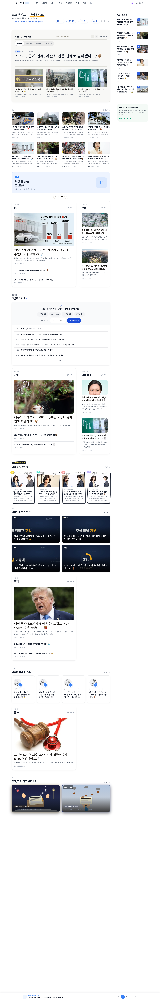
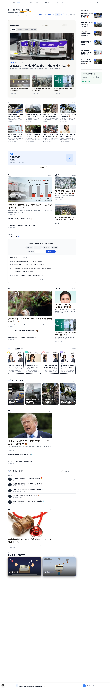
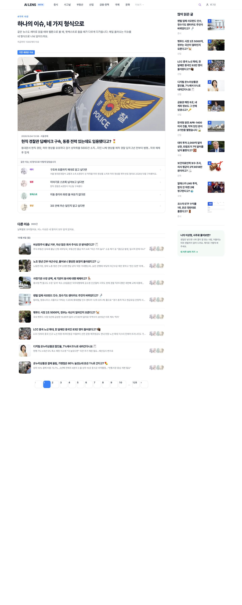
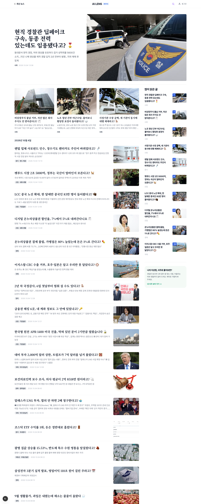
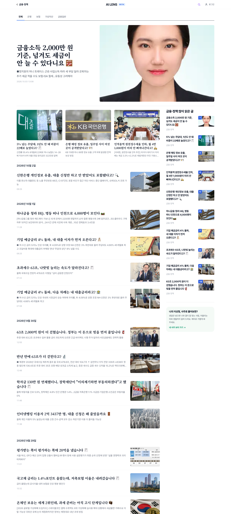
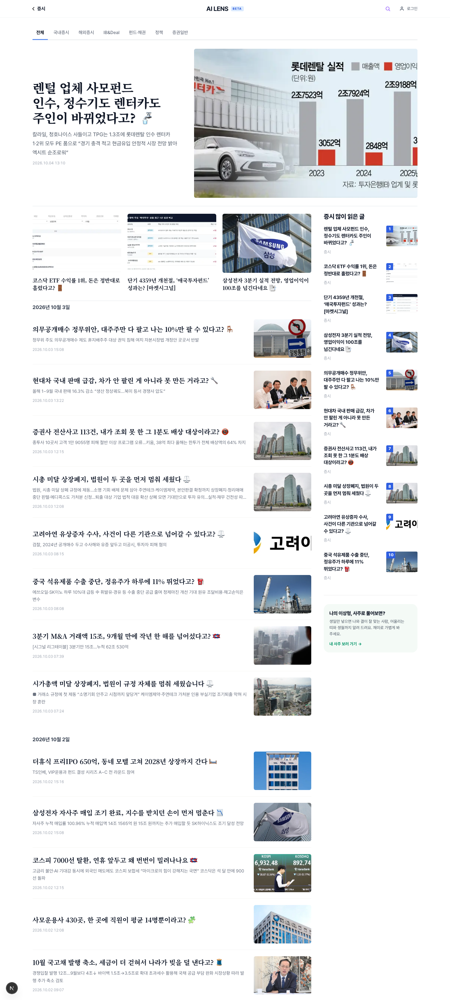
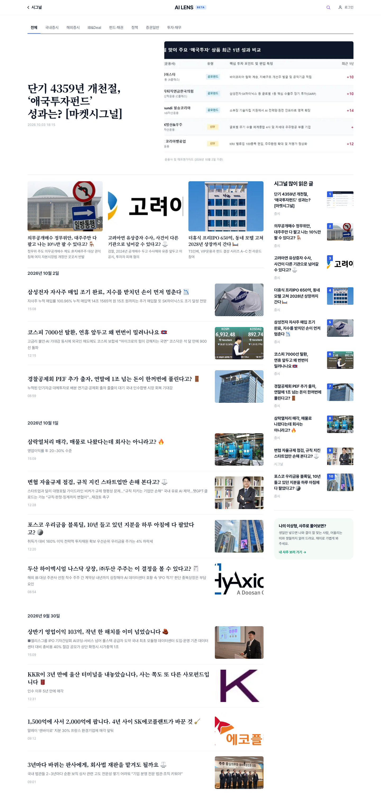
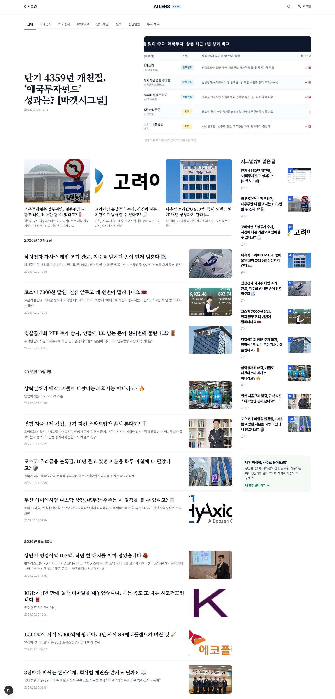
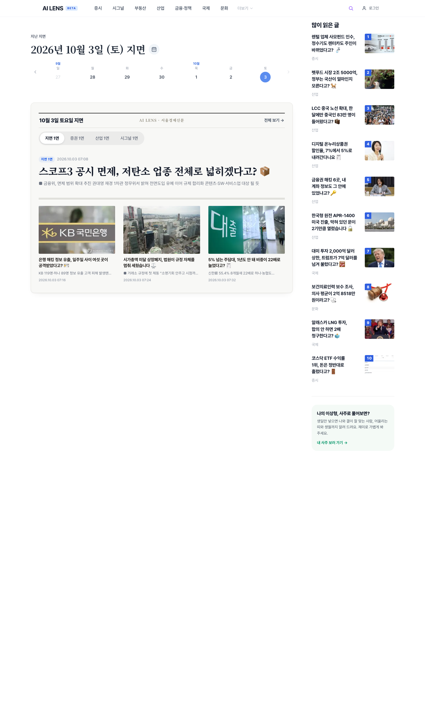
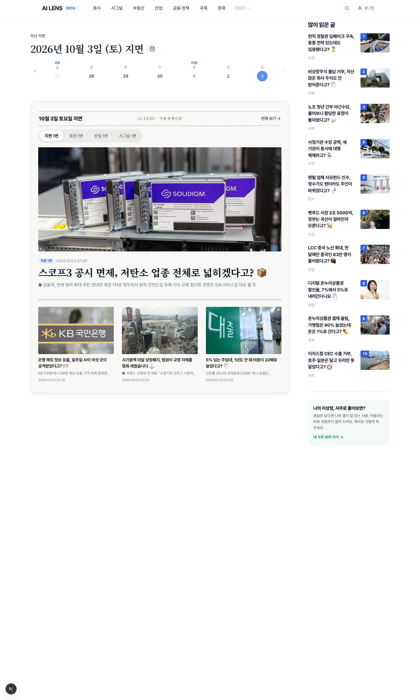

# 2026-10-04 홈·카테고리·지난 지면 리디자인 (전체 기록)

작업자: 문영광 · 기록: Claude · 대상: AI LENS 서비스 프론트(`service/frontend`)

이 폴더 = 하루 동안 한 UI 작업 전체의 기록물. 화면별 비포·애프터 사진, 시도했다 뺀 버전, 왜 그렇게 정했는지, 아직 못 끝낸 것까지 적는다.

## 0. 먼저 밝혀 둘 것 (기록의 한계와 실수)

1. 비포 사진은 작업 전에 못 찍었다. (사진을 직접 열어 확인한 결과, before가 생각보다 "덜 옛날"이다 — 아래 설명 참조.) 이 작업은 사용자 지시("비포·애프터를 꼼꼼히 남겨라")를 받기 전에 대부분 끝나 있었다. 그래서 이 폴더의 `before_*`는 "배포 직전 운영 사이트(fe6 빌드)"를 찍은 것이다. 즉 하루 시작 시점의 화면이 아니라, 중간 배포(fe5·fe6)가 반영된 상태다. 하루 시작 시점의 모습은 사용자가 대화에 붙여 준 캡처로만 남아 있어, 아래 본문에 글로 묘사했다.
2. 중간 버전들(영상 카드 4번 변경, 책장 넘김, 제호 줄 등)은 사진이 없다. 글로만 남긴다(§8).
3. 요청하지 않은 곳을 고친 사고가 두 번 있었다(§9).
4. 애프터 사진은 로컬 개발 서버(`localhost:3000`) 기준이다. 아직 배포 전이다(fe7 대기).
5. 사진은 헤드리스 Chrome 1440px 너비로 찍었다. 화면 내용은 같은 시점의 데이터라 비교가 가능하다. 마우스 호버·모션은 정지 사진에 안 나온다.

## 1. 한 줄 요약

| 영역 | 하루 전 | 지금 |
|---|---|---|
| 홈 상단 지면 | 둥근 그림자 카드, "오늘의 이슈, 4가지 시선" | 종이색 면 + 제호 줄 + 실제 날짜 제목 + 알약 탭 |
| 지난 지면 | 없음 | `/paper/{날짜}` 신설, 주간 띠·달력·연월 드롭다운, 홈에서 ◀ ▶ |
| 카테고리 | 오늘의 이슈 제목 + 단순 목록 | 영문판 구조(히어로 1 + 카드 3 + 날짜별 목록 + 레일) |
| 최신 뉴스 목록(/lens) | 히어로 + 네 시선 4행 | 카테고리와 같은 구조 |
| 우측 레일 | 사주 입력 위젯 + 5건 | 많이 읽은 글(사진·번호·분류) + 안내 카드, 따라다님 |
| 영상 구역 | 어두운 남색 카드 2×2 | 숏폼 세로 카드 4장 |
| 오디오 구역 | 캐릭터 카드 2×2 | 플레이리스트, 그 자리 재생·타임라인·날짜 선택 |
| 검색·AI 노출 | 메타 일부 | 메타 대폭 보강, FAQPage, llms.txt 규격화, IndexNow |

## 2. 화면별 비포·애프터

각 사진은 같은 폴더에 있다. 사진 파일명 앞 숫자가 화면 번호다.

### 2-1. 홈 (`01_before_홈_운영.png` → `01_after_홈_로컬.png`)

| 전 (운영, 사진 촬영 시점 fe6) | 후 (로컬, 미배포 fe7) |
|---|---|
|  |  |

- 문제 발견: (a) 홈 첫 화면에서 기사까지 닿는 거리가 길었다(소개 문구 + 링크 + 칩이 세 줄로 쌓임). (b) 핵심인 "지면" 영역이 위아래 영역과 같은 흰 바탕이라 경계가 약했다. (c) 지난 지면을 볼 방법이 없었다. (d) 영상·웹툰·오디오·카테고리 구역이 제각각이었다.
- 문제 정의: 첫 화면에서 독자가 얻으려는 것은 기사인데, 서비스 설명이 먼저 읽힌다. 영역 구분이 없어 어디가 핵심인지 안 보인다.
- 결정과 이유는 §3(홈 지면), §6(구역 구분)에 상세.

### 2-2. 최신 뉴스 목록 (`02_before_최신뉴스목록_운영.png` → `02_after_최신뉴스목록_로컬.png`)

| 전 (운영, 사진 촬영 시점 fe6) | 후 (로컬, 미배포 fe7) |
|---|---|
|  |  |
- 하루 전: 큰 소개 문구 `하나의 이슈, 네 가지 형식으로`, `가장 새로운 이슈` 라벨, 히어로 안에 레터·웹툰·팟캐스트·영상 질문 4행, 목록마다 아바타 4개.
- 지금: 카테고리 페이지와 같은 구조. 이름은 `최신 뉴스`(§5).

### 2-3. 카테고리 — 금융·정책 (`03_*`), 증시 (`04_*`), 시그널 (`06_*`)

| 전 (운영, 사진 촬영 시점 fe6) | 후 (로컬, 미배포 fe7) |
|---|---|
|  |  |

| 전 (운영, 사진 촬영 시점 fe6) | 후 (로컬, 미배포 fe7) |
|---|---|
|  |  |

| 전 (운영, 사진 촬영 시점 fe6) | 후 (로컬, 미배포 fe7) |
|---|---|
|  |  |
- 하루 전: `증시 — 오늘의 이슈` 제목, 빨간 영문 머리글 `MARKETS`, 단순 목록, 날짜마다 `N개의 아티클`.
- 지금: §4.

### 2-4. 지난 지면 (`05_before_지난지면_운영.png` → `05_after_지난지면_로컬.png`)

| 전 (운영, 사진 촬영 시점 fe6) | 후 (로컬, 미배포 fe7) |
|---|---|
|  |  |
- before는 fe6(17:58 배포)에 올라가 있던 버전이다. 사진으로 확인하니 이미 주간 띠(일~토 7칸)·달력 아이콘·제호 줄·종이색 면이 들어 있다. 처음 만든 날짜 칩 줄 버전(§8의 v1)은 어디에도 사진이 없다. after와의 차이는 달력 팝업의 연·월 드롭다운(눌러야 보임), 홈 ◀ ▶ 연동, 레일, 날짜 제목 정리 등 fe6 이후 변경분이다.

## 3. 홈 지면 영역 — 버전별 이력

사용자 요구: "지면 같은 디자인이 아니라 아쉽다. 아날로그가 아니더라도 영역 구분이 되게. 너무 컨셉충은 싫다. 트렌디하게."

| 버전 | 내용 | 결과 |
|---|---|---|
| v0 (하루 전) | 흰 카드, 테두리·큰 그림자, 탭 아래 미끄러지는 밑줄 | 영역 구분 약함 |
| v1 | 테두리·그림자 제거, 평면 에디토리얼 | 오히려 위·아래와 섞여 구분이 더 약해짐(제 판단 실수) |
| v2 | 연한 종이색 면(`#fbf9f4`) + 얇은 테두리 + 둥근 모서리 | 구분은 좋아짐. 사용자: "누런색 아쉽다, 누렁이 같다" |
| v3 | 면 색을 중성 웜그레이 `#f8f8f6`으로 | 채택 |
| v4 | 신문 제호 줄(이중선, 가운데 `AI LENS · 서울경제신문`, 오른쪽 창간일) | 사용자 "좋은데 컨셉충 아닐까" → 제호 줄을 면 안으로 넣고(제목·날짜 이동과 합침) 이중선을 가는 선으로, 창간 표기 삭제 |
| v5 | 노이즈 질감, 호버 시 떠오르는 그림자, 진입 애니메이션 | 사용자 "짜치는 효과 빼라, 속도가 생명" → 전부 삭제 |
| v6 | 날짜 넘길 때 책장 넘김(3D 회전) | 면 일부만 넘어가 어색 → 삭제(§8) |

최종: 종이색 면(`#f8f8f6`) + 얇은 회색 테두리 + 아주 옅은 정적 그림자 1개, 제호 줄(왼쪽 `10월 3일 토요일 지면`, 가운데 연한 `AI LENS · 서울경제신문`, 오른쪽 ◀ ▶ + `전체 보기 →`), 제호 아래 손으로 그은 듯 살짝 흔들린 가는 선.

- 탭: 밑줄 막대(파랑) → 토스식 세그먼트 알약(연회색 트랙 안에서 선택된 탭이 흰 알약). 이유: 파랑 막대가 제호 줄 아래 가는 선 위에 얹혀 면과 따로 놀았다.
- 제목: `오늘의 이슈, 4가지 시선` → `10월 3일 토요일 지면`. 이유: (1) "4가지 시선"은 관점 4개로 읽혀 오해가 생긴다(뉴스에서 "시선"=논조). (2) "오늘의"는 지난 날을 볼 때 틀린 말이 된다. 사용자 제안("실제 날짜를 쓰자")을 채택. 검색용 `<title>`·메타·`llms.txt`는 그대로 둠(영향 범위가 커서).
- 보조 카드 3장: 세로 구분선 제거(간격으로만), 시각은 전체(`2026.10.03 07:16`) 유지(사용자 지시).
- 사진 모서리 10px → 3px → 값 조정 중 최종 3px로 정리(인쇄 사진 느낌).
- 헤드라인 자간 -0.03em, 줄 간격 1.22(응축).

### 소개 영역(지면 위)
- 하루 전: `뉴스 챙겨보기 어려우시죠?`(31px) + 부제 + 링크 + 칩 4개가 세로 3줄.
- 지금: 왼쪽 문구(26px) 두 줄 + 링크, 오른쪽에 칩 4개를 같은 높이로 배치. 높이가 줄었다(캡처 눈대중으로 약 150px → 100px 안팎, 정밀 측정 아님).
- 사용자 요청: 온보딩 문구는 맨 위에 있어야 한다(내가 아래로 옮겼다가 되돌림).
- 칩: 그림자·연파랑 배경 제거, 흰 배경 + 연한 파랑 테두리 평면 알약.

## 4. 카테고리 페이지 — 버전별 이력

사용자 요구: 영문판(en.sedaily.com `/politics`) 구조와 같게. 영문판 소스(msp-web-ensedaily)와 캡처를 대조해 옮겼다.

| 버전 | 내용 | 비고 |
|---|---|---|
| v0 | 빨간 영문 `MARKETS`, 제목 `증시 — 오늘의 이슈`, `총 298개`, 날짜마다 `N개의 아티클` | |
| v1 | 제목에서 `오늘의 이슈` 삭제(아카이브는 전체 기간이라 틀린 문구), 색 강조 삭제, 건수 문구 삭제 | |
| v2 | 앰버 손밑줄 + 카테고리별 친근한 안내 문구 7개 + `오늘 새 글 N개` 알약(파란 점) | 사용자 "오늘 새 글이 의미 있나?" → 알약 삭제 |
| v3 | 영문판 구조: 탭 줄 → 히어로(큰 제목+요약+큰 사진) → 오른쪽 보조 3건 → 카드 3건 → 날짜별 목록 + 우측 레일 | 오른쪽 열이 길어 왼쪽이 비고, 보조가 레일과 같은 크기로 보여 중요도 구분이 안 됨 |
| v4 (최종) | 히어로 1(전체 폭, 3:2 사진) → 카드 3건 → 날짜별 목록 + 우측 레일 | 독자가 읽는 순서 `큰 것 1 > 3 > 목록`으로 정리 |
| v5 | 헤더·안내 문구 삭제(사용자: "레퍼런스처럼 헤더도 바꾸자") | 제목은 화면에서 숨김(검색용 `h1`), 탭 줄이 맨 위 |

- 헤더: 카테고리 안에서는 상단 메인 메뉴를 숨기고 `‹ 카테고리명`(누르면 메인) + 가운데 로고 + 오른쪽 검색·로그인. 안쪽 폭을 본문과 같은 1320px로 맞춰 화살표 끝과 `전체` 탭 첫 글자가 같은 선에 놓이게 함(아이콘 안쪽 여백 5px 보정).
- 날짜 줄(`날짜별 보기`): 영문판 "Browse by date"의 날짜 범위 달력을 React로 이식(`DateRangeFilter`). 첫 클릭=시작일, 둘째=끝일, 같은 날 두 번=하루, 빠른 선택(오늘·최근 7일·최근 30일·이번 달), 768px 미만은 아래에서 올라오는 시트. 색은 영문판 먹색 대신 서울경제 파랑.
  - 위치 사고: 처음 목록 첫 날짜 줄 옆에 붙였더니 편집형 상단(10/4 글들) 아래 10/3 날짜 옆에 버튼이 떠 있어 어색 → 탭 바로 아래 줄로 이동 → "전체 탭의 날짜 줄은 어색, 세부 카테고리만 살리자" → 하위 탭에서만 표시하고 본문 칼럼 안에 둠(레일 위에 뜨지 않게).
- `전체` 탭 사고: "전체 부분 삭제" 지시를 날짜 줄이 아니라 탭으로 오해해 탭을 지우다가 되돌림(§9).
- 선: 진한 먹색 → 회색 계열 `#d3d6db`(사용자 지시).
- 날짜 라벨: 13px → 16.5px(사용자 지시 "키우고, 좀 더 줄이고").
- 분류 이름이 같은 목록 안에서는 라벨 생략(카테고리), 섞이는 목록(/lens)에서는 라벨 표시.

## 5. 최신 뉴스 목록(/lens)

- 구조: 카테고리와 동일(헤더 `‹ 최신 뉴스`, 히어로 1, 카드 3, 날짜별 목록, 레일). 20건/페이지(기존 8건). 서버 페이지네이션(`/lens/page/N`)·메타·구조화 데이터 유지.
- 이름: `오늘의 시선` → `최신 뉴스`. 이유: 홈의 `최신 뉴스 · 전체 보기`가 이 페이지로 연결되므로 같은 이름. `최신 레터`는 사이트에서 "레터"가 읽기 형식 하나를 뜻해 오해, `최신 이야기`는 서비스에 없는 새 단어.
- 분류 라벨: 제목·카드·목록에 분류 표시. 분류 값이 비어 있는 글(약 19%)은 제목 접두어(`사회 |` 등)의 부서명으로 대체.
- 날짜: 목록의 시각을 `13:10` → `2026.10.04 13:10`(사용자 지시 "날짜 full").
- 걷어낸 것: 소개 문구, `지금까지 1000개의 이슈`, 히어로 안 네 시선 4행, 목록 아바타 4개.

## 6. 홈 구역 구분과 손맛

사용자 요구: "뉴욕타임스처럼 영역을 선으로 깔끔하게", "선은 gray 계열", "스케치한 느낌, 친근하게".

- 구역마다 위에 가는 선 한 줄(`#d3d6db`) + 일정한 간격(32~48px). 대상: 단어 퀴즈, 타임머신, 웹툰, 영상, 오디오, 카테고리 구역.
- 카테고리 구역(`국제` 등): 둥근 테두리 카드·그림자·`오늘의 지면` 라벨을 걷고 선 + 20px 제목 + `전체 보기 →`.
- 손맛은 "주인공 몇 곳"에만(전체에 쓰면 어수선·경제 뉴스의 신뢰감과 충돌): 제호 줄 아래 선(1.6px 흔들림), 구역 제목 밑 손밑줄(2px, 회색). 흔들림 폭 1~2px. 공용 컴포넌트 `HandUnderline`.
- 구역 제목 옆 손그림: 안내 모달(`오늘 이슈, 어떻게 볼래요?`)의 영상·웹툰·팟캐스트 스케치를 정지 버전으로 가져옴(`VideoSketch`·`WebtoonSketch`·`PodcastSketch`). 처음엔 기존 아이콘 모음의 영상 아이콘(웃는 얼굴 스마트폰)을 넣었는데 사용자가 "일러스트 좀 그러네요, 여기서는 잘 만들었으니 그대로 쓰자"며 모달 그림 재사용을 지시했다.
- 기본 호버·눌림: 전수조사 결과 호버 없는 링크·버튼이 81개 파일 218곳 → 전역 CSS 한 벌로 기본 반응(링크 살짝 투명, 버튼 살짝 어두움+눌림). 전용 호버가 있는 곳은 그대로 우선.

## 7. 구역별 상세

### 7-1. 영상 — 버전별
| 버전 | 내용 | 사용자 반응 |
|---|---|---|
| v0 | 어두운 남색 카드 2×2, 영상 프레임 썸네일, 제목은 사진 위 | 썸네일 아쉽다 |
| v1 | 큰 1 + 작은 3, 밝은 에디토리얼, 기사 사진 포스터 | 다른 구역과 다르지 않다 |
| v2 | NYT `Latest Shows` 구조: 카드마다 다른 단색 면 4열, 왼쪽 글·오른쪽 사진 | 글이 많다·트렌디하지 않다 |
| v3 (최종) | 숏폼 세로 카드(3:4) 4장, 사진 꽉 채움, 아래 제목 3줄 이내, 위에 분류 태그·재생 원(유리 질감) | |
- 문제 근거: v0의 썸네일은 영상의 임의 프레임이라 `직 경찰관 구속`처럼 글자가 잘렸고, 영상 속 큰 글씨와 카드 제목이 겹쳐 제목이 두 번 읽혔다.
- 포스터는 같은 이슈 기사 사진(`photo_image_url`)을 서버에서 영상 id로 매칭(id 동일 확인). 없으면 프레임.
- 시도했으나 안 한 것: 마우스 오버 무음 미리보기 재생(유튜브 임베드를 미리 불러야 해 속도 부담).

### 7-2. 웹툰
- 한 번 평면 카드로 바꿨다가 사용자 지시("왜 쓸데없는 데를 고치나")로 이전 디자인(기울어진 만화 컷, 두꺼운 테두리, 오프셋 그림자)을 복원. 유지/변경: `✦ WEBTOON PILOT` 알약 삭제, 제목 앞에 손그림 추가(사용자 지시).

### 7-3. 오디오 — 버전별
| 버전 | 내용 |
|---|---|
| v0 | 작은 `오디오` 머리글 + 캐릭터 원형 카드 4장(이미지가 깨져 보임) |
| v1 | 플레이리스트 2열 × 2행 |
| v2 (최종) | 세로 한 열 플레이리스트, 영역 안 스크롤(높이 392px), 행 클릭=그 자리 재생·일시정지, 재생 중 행 아래 타임라인(현재/전체 시간 + 끌 수 있는 진행 막대), 곡이 끝나면 다음 곡, 날짜 머리글(스크롤 중 고정), 12건씩 추가 로드, 날짜 범위 선택 |
- `오디오` 머리글 삭제(사용자 지시).
- 날짜 필터 버그: 고르는 즉시 화면의 최신 12건만으로 걸러 빈 목록처럼 보이다가 전체(1,000건·약 600KB) 로드 후에야 바뀜 → 로드 중 `불러오는 중…` 표시, 목록 맨 위로 이동.
- 한계: 목록 재생과 하단 고정 플레이어는 별개 오디오라 동시에 재생하면 겹침. 상세로 가는 `›`는 행 오른쪽. 영상 링크(유튜브)형 항목은 하단 플레이어로 넘김(지금은 전부 mp3).

### 7-4. 우측 레일(모든 페이지 공통)
- 사주 입력 위젯(약 746줄) 삭제 → 안내 카드(`나의 이상형, 사주로 풀어보면?`). `어제 지면은 뭐였더라?` 카드는 지면 영역의 ◀ ▶와 중복이라 삭제.
- `많이 읽은 글`: 영문판 `{분류} Most Read` 구조(제목, 굵은 제목 3줄, 작은 분류 라벨, 오른쪽 사진 100×66 + 모서리 번호 배지). 홈 6건, 그 외 10건. 카테고리 페이지는 지금 보는 분류·하위 분류의 글로 채우고 제목도 `{분류} 많이 읽은 글`. 조회수 집계가 없어 실제로는 최신 글(이름과 다름).
- 위 시작선: 지면 영역과 소개 제목 높이에 맞춰 52px.
- 스크롤 따라다니기: 내부 스크롤(`max-height`) 방식은 "따로 스크롤된다"는 지적 → 제거. 대신 레일이 화면보다 길면 `top = min(76, 화면높이 − 레일높이 − 16)`으로 계산해 "아래가 화면 아래에 닿을 때까지 같이 스크롤된 뒤 고정".
- 분류 라벨 `오늘의 시선`(분류 없을 때 제가 넣은 임시 문구) → 사용자 지적 → 실제 분류 또는 제목 접두어 부서명, 둘 다 없으면 표시 안 함.

## 8. 시도했다가 뺀 것 (이력)

| 시도 | 뺀 이유 |
|---|---|
| 지면 날짜 이동 v1: 날짜 칩 가로 줄 | 칩이 많아지면 늘어짐(사용자) |
| v2: `주 \| 월` 전환 버튼 + 가로 스크롤 띠 | 보기 전환·설명 문장·띠가 기사보다 시선을 먼저 가져감, 달이 3일뿐인데 달력이 280px 차지 |
| v3: 제목이 날짜 선택기(눌러 달력) | 달력이 열리면 아래 날짜 띠와 같은 날짜가 겹침("중복이라 어색") |
| v4 (최종): 제목 옆 달력 아이콘 + 한 주 7칸 띠(◀ ▶ 한 주씩) + 달력 안 연·월 드롭다운(스크롤) | 사용자 "연도가 늘면 찾기 어렵다" → 격자 교체 방식에서 세로 드롭다운으로 |
| 책장 넘김 모션(3D 회전·그림자) | 면 안 내용만 도는 것이 어색, 면 전체를 넘기려면 WebGL이 필요한데 규모 대비 이득 작음. 대체: 0.16초 페이드 |
| 노이즈 질감·호버 떠오르기·진입 모션 | 사용자 "짜치는 효과 빼라, 속도가 생명" |
| 팔레트: 서울경제 파랑→남청 `#1f4e9e`→먹색 하나 | 사용자가 말한 "신문 색상"은 면 색뿐이었음. 요청 범위 밖 변경이라 되돌림(§9) |
| 제호 줄 장식(창간일, 이중선) | 컨셉이 앞선다는 지적 |
| 영상 카드 3가지(v0~v2) | §7-1 |
| 지난 지면 안내 카드(사이드) | 지면 영역과 기능 중복 |

## 9. 판단 실수·사고 기록 (재발 방지)

1. 요청하지 않은 곳을 고침: (a) 웹툰 구역을 평면화 → 복원. (b) 글자·밑줄·칩 색까지 팔레트 교체 → 복원. 원칙: 말씀하신 영역만 고친다.
2. 전체 탭 삭제 오해: "전체 삭제" 지시를 날짜 줄이 아닌 탭으로 읽음 → 되돌림.
3. 비포 미촬영: §0.
4. 사이트맵 파싱 오류: 사이트맵 상한을 풀면서 영상 URL의 `&`를 이스케이프하지 않아 서치콘솔이 70340행에서 오류(발견된 페이지 0). 이스케이프 + 파싱 검증 후 배포. 서치콘솔의 오류 표시는 구글이 다시 읽을 때까지 남음. 교훈: 새 출력 형식은 XML 파서로 검증한 뒤 배포.
5. 로컬 캡처와 운영 캡처 혼동: 사용자가 보낸 캡처 중 일부는 운영(옛 화면)이었다. 주소창이 `localhost:3000`인지 확인.

## 10. 검색·AI 노출(GEO) — 이번 세션 추가분

(상세한 점검·판단은 `2026-10-04-검색노출-SEO점검과-개선.md` 참조. 이 세션에서 더한 것만 적는다.)
- 메타: 기사 페이지 35 → 81개 메타 태그, 홈 28 → 59개. Dublin Core·지역(서울 종로)·hreflang·`news_keywords`·`og:updated_time` 등.
- 구조화 데이터: 기사 `FAQPage`(4가지 시선 Q&A), `NewsArticle`에 `abstract`·`keywords`·`isBasedOn`(원문 취재 링크)·저작권 필드, 매체 정보에 `award`·`taxID`·`sameAs`(Wikidata `Q12601146`·위키백과 한/영·소셜), 내비 `SiteNavigationElement`, 지난 지면 `CollectionPage`+지면별 `hasPart`.
- 설명문: 카테고리·목록·약관 등 33~42자 → 80~150자.
- `llms.txt`: llmstxt.org 규격(H1 → 요약 블록 → H2 링크 목록 → `Optional`)으로 재구성, 신뢰 정보 절(발행처·위키·수상·제작 방식), `llms-full.txt`(최근 기사 60건 요약, 약 140KB, 30분 갱신) 신설, `<link rel="describedby">`.
- `robots.txt`: 열어두는 컨셉(검색·AI 검색·AI 학습 봇 모두 허용, SEO 도구 크롤러만 차단), `Content-Signal: search=yes, ai-input=yes, ai-train=yes`. 본지(sedaily.com) 정책(학습 봇 차단)을 한 번 따라 했다가, "학습 봇을 막아도 인용은 안 막힌다"는 조사와 "차단 매체의 유입 감소(주간 약 7%)" 근거로 되돌림.
- IndexNow: 발행·수정 시 Bing 등에 변경 주소 즉시 통지(키 파일 `public/6e5571d2…txt`).
- 웹툰·영상·오디오 상세 페이지에도 같은 수준의 메타·구조화 데이터, 제목의 부서 접두어·이모지 정제.
- 쿡북(v1 SEO·GEO·AEO) 대조 결과 반영분: IndexNow, 누락 봇 추가, llms.txt 형식.

## 11. 성능·캐싱

- 지면 날짜 목록: 최신 1,000건 응답이 2.96MB라 Next 데이터 캐시 한도(2MB)를 넘어 캐시가 안 됐다 → 날짜 목록만 서버 메모리 5분 보관, 동시 요청 합치기.
- 홈 ◀ ▶: 브라우저가 CMS에서 하루치 전체(64KB·36건)를 받아 줄이던 것을 서버 API(`/api/paper/{날짜}`)가 16건만 골라 24KB로 전달(약 62% 감소). 응답은 브라우저 1분, CDN 5분 캐시. 바로 앞날을 한가할 때 미리 받아 첫 클릭이 즉시 바뀜.
- 오디오: 홈을 열 때 12건만 심고(이전 4건), 전체 목록(약 600KB)은 스크롤 끝 근처나 날짜 선택 때 처음 받음.
- 같은 3MB 응답(`fetchLensPosts(1000)`)이 분류 페이지·`/lens`에서도 쓰여 캐시가 안 되는 문제는 아직 손대지 않음.

## 12. 배포 상태

| 빌드 | 시점 | 내용 |
|---|---|---|
| fe5 | 16:xx | 사이트맵 수정, 지난 지면 첫 버전, 메타·GEO 보강 일부 |
| fe6 | 17:58 | 지난 지면 주간 띠·달력 아이콘, 홈 제호 줄·종이색 면·알약 탭, 레일 개편(10건·분류), 카테고리 영문판 구조 등 17:58까지의 작업 — 이 폴더의 `before_*`가 이 상태(= 사진상 하루 시작 화면이 아니라 하루 작업의 상당 부분이 이미 반영된 화면) |
| fe7 | 대기 | 이 문서의 모든 애프터. 사용자 허가 후 배포 |

## 13. 아직 남은 것

1. `/timeline/{날짜}` 운영 500(기존 문제, 하루 전부터 지속). 고칠지 결정 필요.
2. 제목 폰트(Noto Serif KR → 고운바탕·마루부리·함렛 후보 비교 페이지를 만들었으나 선택 대기. 비교 페이지는 삭제함).
3. `FAQPage` 유지 여부(쿡북 R13의 ItemList 결정과 어긋남).
4. `국제`처럼 짝 없는 카테고리 구역의 오른쪽 3분의 1이 빈 구조.
5. 오디오 목록 재생과 하단 플레이어의 동기(재생 중 표시, 동시 재생 방지).
6. 오디오·영상·웹툰의 날짜 필터는 CMS 상한 1,000건 안에서만 동작(9월 중순 이전은 없음).
7. 조회수 집계가 없어 `많이 읽은 글`이 최신 글로 대체되어 있음.
8. 단어 퀴즈·타임머신 구역 제목 형태 통일.
9. 서치콘솔 사이트맵 재제출 결과 확인(오류 표시는 구글 재수집 후 갱신).
10. 모바일 폭 점검(이번 사진은 전부 1440px 데스크톱).

## 14. 웹툰·영상·오디오 목록 페이지 폐기 (fe7 배포 이후 추가, 로컬만, 미배포)

- 문제 발견: 홈의 웹툰·영상·오디오 구역에 "더보기"가 있고 `/webtoon`, `/video`, `/listen` 목록 페이지가 따로 있다. 같은 기사의 다른 형식이라 `/lens`와 내용이 겹친다.
- 문제 정의: 형식별 목록은 기사 상세의 형식 탭과 중복이다. 특정 글의 웹툰을 보려면 `/lens`에서 글을 찾아 탭으로 보면 된다.
- 결정(사용자, 2026-10-04): 홈은 미리보기만 둔다. 목록 페이지와 "더보기"는 없앤다. 사진은 찍지 않고 빠르게 진행.
- 변경:
  - 삭제: `/webtoon`, `/webtoon/all`, `/webtoon/page/N`, `/video`, `/video/page/N`, `/listen`, `/listen/page/N`의 페이지와 목록 컴포넌트·공용 파일.
  - 유지: `/webtoon/{slug}`, `/video/{slug}`, `/listen/{slug}`, `/webtoon/series/{slug}`(색인·공유 링크 보존).
  - 이동: 삭제한 주소는 `next.config.ts`에서 `/lens`로 permanent 리다이렉트. 로컬 dev 확인에서는 308.
  - 링크 정리: 홈 세 구역 "더보기", 하단 오디오 플레이어 "전체 목록 보기", 헤더 탭 3개, 푸터 링크 3개, sitemap 3줄, 사이트 구조 JSON-LD 3항목, 공지 막대 웹툰 문구, middleware 페이지 규칙.
- 검증: tsc·eslint 오류 0(.next 오래된 타입 캐시 제외), 로컬에서 5개 옛 주소 모두 /lens로 이동, 시리즈 상세 200.
- 가설(검증 전): 옛 목록 주소의 검색 유입은 /lens로 합쳐질 것. 배포 후 Search Console에서 해당 주소의 노출·클릭 추이를 1~2주 확인하고, 유입이 크게 줄면 되돌림을 검토한다.
- 남은 일: 오디오 구역을 "미리보기만"에 맞게 단순화할지 결정(날짜 필터·더 불러오기 현재 유지), 배포(허가 후), 배포 후 운영 확인.
- 검색엔진·AI 노출 정리(같은 날 추가): sitemap에서 목록 3개 제거, 사이트 구조 JSON-LD에서 제거, `llms.txt`에서 웹툰·영상·오디오 목록 줄을 "별도 목록 없이 개별 주소로 제공, 목록은 /lens"로 교체하고 이미 폐기된 `/archive` 줄 2개를 정리, 웹툰·영상·오디오·시리즈 상세의 BreadcrumbList 2단계를 `최신 뉴스(/lens)`로 변경, 오디오 상세 JSON-LD `partOfSeries` 주소를 `/lens`로 변경, 상세 화면의 "목록으로" 링크 4곳을 `/lens`로 변경. `robots.txt`·`llms-full.txt`·IndexNow·RSS에는 해당 주소가 없어 변경 없음. `tsc` 오류 0.
- 홈 미리보기 정리(같은 날 추가, 사용자 결정): 웹툰 카드의 `1화·2화·3화` 배지 삭제(최신 4건이라 회차가 아님). 오디오 구역은 날짜 필터·더 불러오기·날짜 머리글·스크롤 박스를 없애고 최신 5건 목록으로 축소(그 자리 재생·타임라인은 유지, 이전 구현은 `AudioPreviewSection.with-filter.tsx`에 백업). 서버가 내려주는 초기 목록도 12건→5건. 구역별 "더보기"는 달지 않기로 결정(웹툰 더보기가 최신 뉴스로 가면 기대와 다름).
- 홈 미리보기 정리(같은 날 추가, 사용자 결정): 웹툰 카드의 `1화·2화·3화` 배지 삭제(최신 4건이라 회차가 아님). 오디오 구역은 날짜 필터·더 불러오기·날짜 머리글·스크롤 박스를 없애고 최신 5건 목록으로 축소(그 자리 재생·타임라인은 유지, 이전 구현은 `AudioPreviewSection.with-filter.tsx`에 백업). 서버가 내려주는 초기 목록도 12건→5건. 구역별 "더보기"는 달지 않기로 결정(웹툰 더보기가 최신 뉴스로 가면 기대와 다름).
- 정렬 기준 확인: 운영 API에서 웹툰·영상·오디오·레터 4개 채널 모두 1000건 중 첫 건이 가장 최근 발행 시각(2026-10-04 04:38 UTC)이고 발행 시각 내림차순. 홈 미리보기는 앞에서부터 자르므로 전부 최신순.
